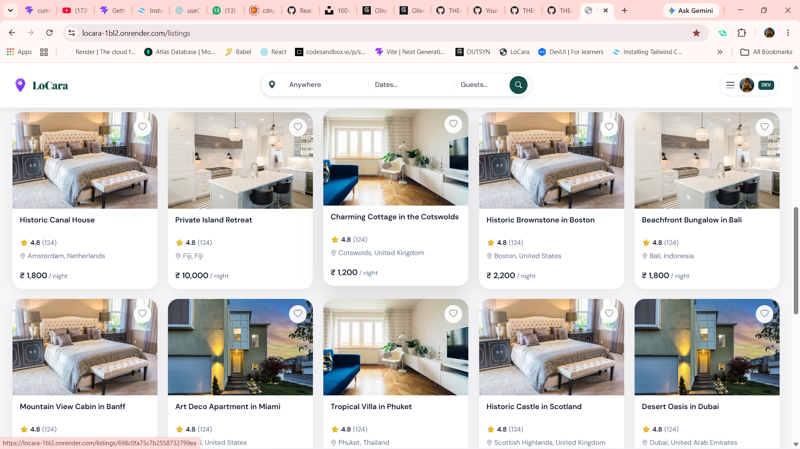
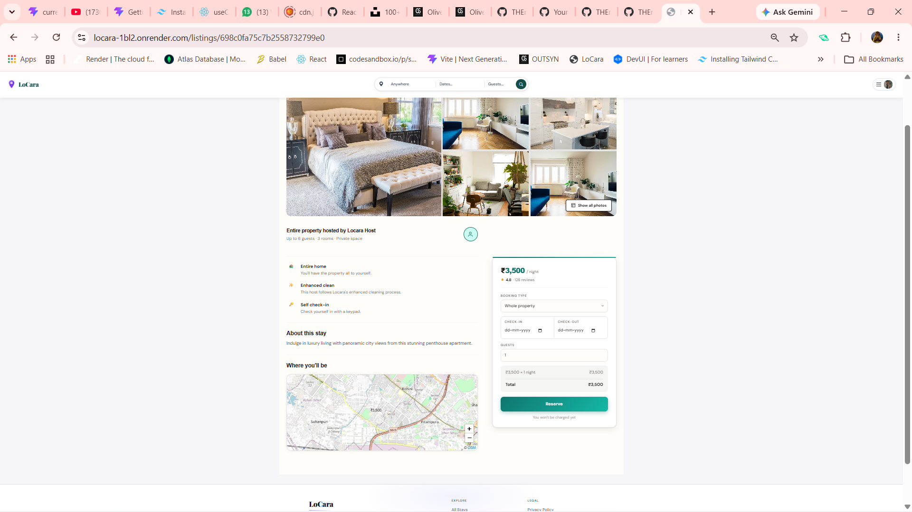
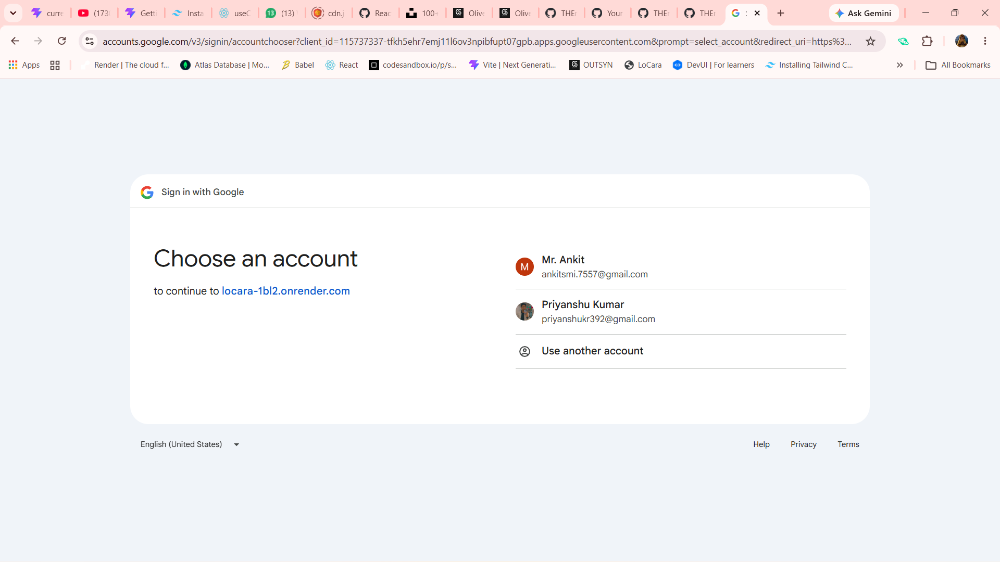
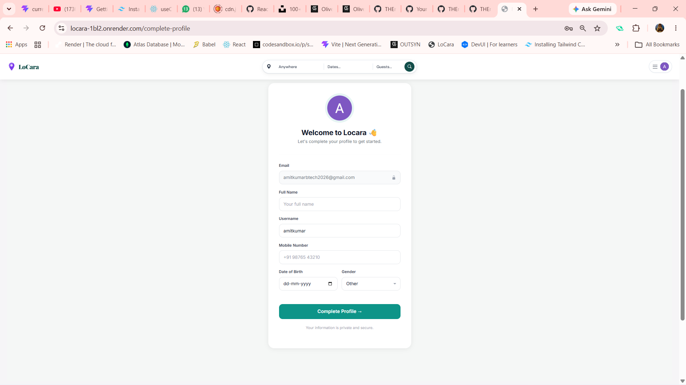
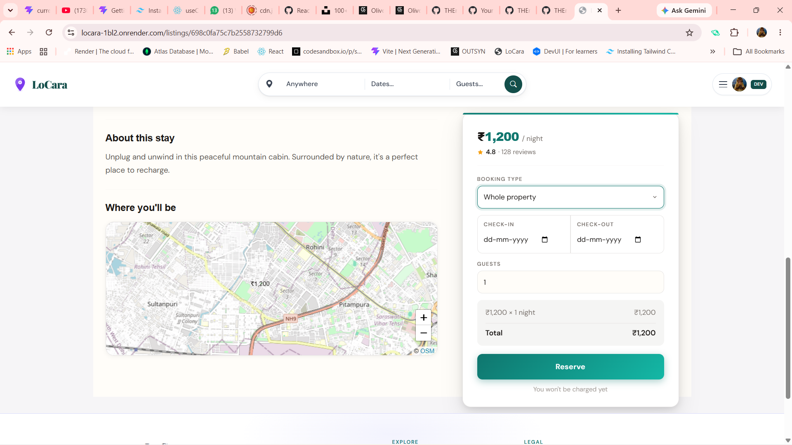

# 🏡 Locara

**Locara** is a modern full-stack property rental and booking platform inspired by Airbnb. It enables users to discover, list, book, and manage rental properties through a clean, responsive interface. Built with the MERN ecosystem (MongoDB, Express.js, Node.js) and EJS for server-side rendering, Locara focuses on providing a secure, scalable, and user-friendly experience.

---

## 🚀 Live Demo

**Website:** https://locara-1bl2.onrender.com

---

## ⭐ Key Highlights

- 🔐 Google OAuth 2.0 Authentication
- 🏡 Property Listing & Booking Platform
- 📅 Property Booking System
- ☁️ Cloudinary Image Uploads
- 🗺️ Interactive Maps with Leaflet
- 📱 Fully Responsive Design
- 🚀 Deployed on Render
- 🍃 MongoDB Atlas Database

---

## ✨ Features

### 🔐 Authentication

* Email & Password Authentication
* Google OAuth 2.0 Login & Signup
* Automatic account linking via Google
* Secure password hashing using bcrypt
* Forgot Password functionality
* Session-based authentication
* Protected routes
* Profile completion flow for new Google users

---

### 👤 User Profile

* Complete profile onboarding
* Google profile avatar integration
* Username validation
* International mobile number support
* Role-based users (User / Developer)

---

### 🏠 Property Listings

* Create new property listings
* Edit existing listings
* Delete listings
* Upload multiple property images
* Property details page
* Property categories
* Responsive listing cards

---

### 📅 Booking System

* Property booking
* Booking management
* Date availability
* Booking history
* Reservation workflow

---

### 🗺️ Maps & Location

* Interactive Leaflet Maps
* Property location display
* Location-based information

---

### ☁️ Image Management

* Cloudinary image storage
* Secure image uploads
* Optimized image delivery

---

### 📱 Responsive Design

* Desktop optimized
* Tablet support
* Mobile-friendly layout
* Modern UI inspired by Airbnb

---

## 🛠️ Tech Stack

### Frontend

* EJS
* HTML5
* CSS3
* Bootstrap 5
* JavaScript (ES6)
* Font Awesome
* Bootstrap Icons

### Backend

* Node.js
* Express.js
* Passport.js
* Express Session
* Connect Flash
* Method Override

### Database

* MongoDB Atlas
* Mongoose

### Authentication

* Passport Local Strategy
* Passport Google OAuth 2.0
* bcryptjs

### File Storage

* Cloudinary
* Multer

### Deployment

* Render
* MongoDB Atlas

---

## 📂 Project Structure

```text
Locara
│
├── config/
├── middleware/
├── models/
├── public/
│   ├── css/
│   ├── js/
│   ├── uploads/
│
├── routes/
├── utils/
├── views/
│   ├── includes/
│   ├── layouts/
│   ├── listings/
│   ├── users/
│
├── index.js
├── package.json
└── README.md
```

---

## ⚙️ Installation

Clone the repository

```bash
git clone https://github.com/THEmen9/Locara.git
```

Navigate into the project

```bash
cd StayNest
```

Install dependencies

```bash
npm install
```

Create a `.env` file

```env
MONGO_URL=your_mongodb_connection
SESSION_SECRET=your_secret

CLOUDINARY_CLOUD_NAME=your_cloud_name
CLOUDINARY_API_KEY=your_api_key
CLOUDINARY_API_SECRET=your_api_secret

GOOGLE_CLIENT_ID=your_google_client_id
GOOGLE_CLIENT_SECRET=your_google_client_secret
```

Run the development server

```bash
npm start
```

Open your browser

```
http://localhost:5050
```

---

## 📸 Screenshots

* Home Page


* Property Listings


* Property Details


* Google Login


* Complete Profile


* Booking Page


---

## 🔒 Security Features

* Password hashing using bcrypt
* Secure session management
* Environment variable protection
* OAuth authentication
* Input validation
* Protected routes
* Flash message handling

---

## 📈 Future Improvements

* Facebook Authentication
* Wishlist / Favorites
* User Reviews & Ratings
* Advanced Search & Filters
* Notifications
* Chat between Host & Guest
* Admin Dashboard
* Payment Gateway enhancements
* Email verification
* OTP verification
* Progressive Web App (PWA)

---

## 🤝 Contributing

Contributions, suggestions, and improvements are welcome.

1. Fork the repository
2. Create a new branch
3. Commit your changes
4. Push to your branch
5. Open a Pull Request

---

## 👨‍💻 Developer

**Ankit Kumar**

* GitHub: https://github.com/THEmen9
* LinkedIn: *(Add your LinkedIn profile URL)*

---

## 📄 License

This project is licensed under the **MIT License**.

---

### ⭐ If you like this project, don't forget to star the repository!
